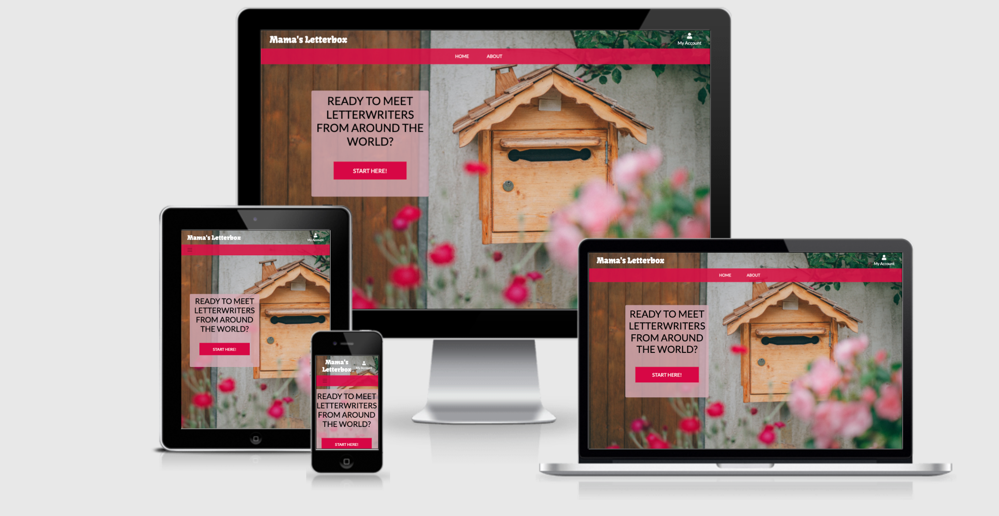

# Mama's Letterbox

<div align="center">
    
</div>
<br>

[View deployed site here](https://mamas-letterbox.herokuapp.com/)

## Project Description
Many people try to reduce the presence of screens in their lives and go back to activities they used to enjoy before screens took over our lives. Writing letters is one of them. Being a parent of a young child during the pandemic has been a challenging and often isolating experience for many parents, especially moms. This website seeks to help parents, especially but not exclusively mothers of young childen, to make meaningful connections with other parents around the world through letters.

The current version of the application is an MVP designed to provide basic functionality. In the future, additional functionalily will be implemented to allow a hopefully growing number of users to search the website more effectively and create more appealing profiles.

Currently, the general goals of the application are:
* Provide visitors with a sense of the goals of the application
* Provide login, logout, and new user registration functionality
* Provide plan subscription functionality
* Allow registered users to create and update their personal profile
* Allow registered and subscribed users to view other users' profiles and contact them via email


## UX

### Core Target Audience
#### The core target audience of this application is:
* Parents, especially mothers, who are interested in establishing meaningful connections with other parents
* Parents, especially mothers, who are looking to spend less time in front of screens 
* Parents, especially mothers, who would like to send and receive more snail mail again


#### Users of this application are searching for:
* Other parents with similar interests and/or children of similar ages to connect
* A way to increase the amount of offline acctivities in their lives

#### Client Stories
Client Stories and the status of the features in response to those stories can be found in the [User Stories Overview](https://docs.google.com/spreadsheets/d/1CRY7aYiLONmYjMFSnk4xuDKDCOrky4-98dOgRmqB0fU/edit?usp=sharing).

### Wireframe Mockups: 
- [Landing Page](static/images/mamasLetterboxHOME.png)
- [About Page](static/images/mamasLetterboxABOUT.png)
- [Login Page](static/images/mamasLetterboxHLOGIN.png)
- [Profile Page](static/images/mamasLetterboxPROFILE.png)
- [Profile Creation Page](static/images/mamasLetterboxCREATE.png)
- [Profile Editing Page](static/images/mamasLetterboxEDIT.png)
- [Subscription Page](static/images/mamasLetterboxSUBSCRIPTION.png)
- [Penpals Listing Page](static/images/mamasLetterboxLIST.png)


## Features
#### Across Pages
Every page features a responsive **navigation bar** with conventional placing of **logo** (top left).

Every page features a background appropriate to the theme of writing letters. 

Every pages features an **account icon** in the upper right corner to allow visitors to easily register or login and to allow logged-in users to log out.

#### Registration
The registration page allows new users to register. The **input fields** for username and password have input **validation** to ensure the new account is properly set up. Users who are already registered can get to the login page by clicking on the **account icon** in the upper right corner.

#### Login
The login page allows existing users to log in to their account. The **input fields** for username/e-mail address and password have input **validation** to ensure the input matches the requirements for each field. New users can get the registration page by clicking either on the **account icon** in the upper right corner..

#### Landing Page
The landing page tells visitors in a few simple words what the website is about. The **Start Here button** directs to the About page and thus provides a quick way to learn more.

#### About Page
The About page tells visitors more about the project, its goals, current fucntionality, and future features.

#### My Profile Page
This page is visible only to registered users. Newly registered users are directed to the **Create Profile page** to create their personal profile for other users to see. Existing users can see the information they have provided and use the **Edit Profile button** to update their profile.

##### Find a Penpal! Page
This page is visible only to subscripers. Users who have not purchased a subscription, are directed to the **Subscription page**. Subscribed users can see a list with the basic data of all registered users: name, age (if entered), and country of residence. By clicking the **View Profile button**, subscribers can see additional profile details and make initial contact with the profile owner if desired.

#### Subscription Page
The subscription page directs the user to Stripe, where they can purchase a subscription, currently available at the symbolic price of $0.50 to allow new users to test out the site without any risk while additional features are still being developed. This approach will hopefully make more users purchase a subscription and thus make the site more attractive for future users.

### Existing Features
- Header Navigation Bar - Exists on [every page](templates/main-nav.html) and allows all users to easily navigate all the website's pages and find what they are looking for quickly, including being led back to their profile page when clicking on the **Account icon** and the on **My Profile**. (When clicking on the icon while not logged in, a visitor will be able to either register or log in.)
- [User Account Administration](templates/allauth) - This site uses the **Allauth** package to provide vistors with comprehensive user account management, including account creation and email verification, login, logout, and forgotten password recovery.
- [Profile Creation](penpals/templates/penpal_create) and [Profile Editing](penpals/teamplates/penpal_edit) allowys registered users to create and edit their [personal profile](penpals/templates/penpal_detail) tied to their user account and visible to users with subscriptions.
- [Penpal Listing](penpals/templates/penpal_list) allows **users** to see a list of other registered users, their age, language(s), and location. **Subscribers** can click on a button next to the profile and see more profile details including **contact information**.
- The [Subscription Feature](subscriptions/templates/home) allows users to purchase a monthly subscription, currently at a trial price of U.S. $0.50/month to be able to view complete profile details of other users registered in the penapl database and contact them. Existing subscribers have the option to cancel their subscription using the **contact link** provided in the [Subscribers' view of the page](subscriptions/templates/subscriber.html).

### Features to Implement in the Future
- Profile pictur feature as part of the penpal profile.
- Integrated chat option.
- Ability to manage subscription directly from the website. 
- A blog spotlighting existing members


## Technologies Used

### Workspace

- [Gitpod](https://www.gitpod.io/)

### Languages

- [HTML5](https://developer.mozilla.org/en-US/docs/Web/Guide/HTML/HTML5)
- [CSS3](https://developer.mozilla.org/en-US/docs/Web/CSS)
- [JavaScript](https://www.javascript.com/)
- [Python3](https://www.python.org/)

### Frameworks, Libraries, Other

- [Heroku](https://dashboard.heroku.com/) - The cloud platform used to deploy and run the code pushed to the associated GitHub repository.
- [Django](https://www.djangoproject.com/) - The project was built using Django's web framework.
- [SQLite](https://www.sqlite.org/index.html) - Pefault Django's database used in development.
- [PostgreSQL](https://www.postgresql.org/) - Production database through Heroku.
- [Bootstrap](https://getbootstrap.com/docs/5.0/getting-started/introduction/) - CSS framework.
- [jQuery](https://jquery.com/) - JavaScript framework.
- [Google Fonts](https://fonts.google.com/) - Additional fonts.
- [Font Awesome](https://fontawesome.com/) - Icons.
- [Stripe](https://stripe.com/docs) - Stripe was used for the subscription plan.

### Version Control

- [Git](https://git-scm.com/)
- [Github](https://github.com/)

### Wireframes

- [Balsamiq](https://balsamiq.com/)

## Testing 
Testing information can be found in a separate [TESTING.md file](TESTING.md).

## Deployment 
(Steps taken from and followed based on [Fraciska Du Toit's project Happybean](https://github.com/Franciskadtt/happybean))

### How to Clone the Repository
To clone this project into Gitpod you will need a Github account and an HTML 2 PDF Rocket account. You can [create a Github account here](https://github.com/), and you can [create an HTML 2 PDF Rocket account here.](https://www.html2pdfrocket.com/).

Then follow these steps:
1. Log into [Gitpod](https://gitpod.com) with your gitpod account.
2. Navigate to the [Project GitHub repository](https://github.com/katjacodes/mamasLetterbox)
3. Click the green "Gitpod" button in the top right corner of the respository
4. This will trigger a new gitpod workspace to be created based on the code in GitHub. There, you will be able to work locally.

To work on the project code within a local IDE such as VSCode, Sublime Text, etc.:
1. Navigate to the [Project GitHub repository](https://github.com/katjacodes/mamasLetterbox)
2. Click the "Code" download button next to the green "Gitpod" button.
3. In the Clone section, select HTTPs and copy the clone URL for the repository. 
4. Open your local terminal.
5. Change the current working directory to the location where you want the cloned directory to be located.
6. Type ```git clone```, and then paste the URL you copied in Step 4.
7. Press Enter for your local clon to be created.

You will need to create a [Stripe account](https://stripe.com/) to integrate payment function for the subscription plan.

### Setting the Stage
In preparation for deployment, create a new settings folder inside the mamasLetterbox project folder, move the ```settings.py``` file inside it, and rename it to ```base.py```. The ```base.py``` file contains all the settings that are needed for in local develovpment mode as well as for deployment. Additionally, create a ```development.py``` file and a ```heroku.py``` file, each containing the respective settings and both contaning the following at the top: ```from .base import *```. This will ensure that all the settings in the ```base.py``` file extend to the othe settings files as well.

Because the settings have been moved into a new folder, path information needs to be updated in the following places:

In ```base.py``` change

```BASE_DIR = Path(__file__).resolve().parents.parents```
to
```BASE_DIR = Path(__file__).resolve().parents.parents.parents``` or ```BASE_DIR = Path(__file__).resolve().parents[2]```

In ```manage.py``` change

```'mamasLetterbox.settings'```
to
```'mamasLetterbox.settings.development'```

Next, download the the python-dotenv package to facilitate the connection between your ```base.py``` file and the untracked ```.env``` file you are about to create:

```pip3 install python-dotenv```

At the top of your base file import the following:

```
from dotenv import load_dotenv
load_env()
```

Make sure that ```load_env()``` appears *above* ```from .base immport *```. The ```base.py``` file needs the information stored in the .env file to supply the correct information in development mode.

Create an ```.env``` file at the root of the project, add it to the ```.gitignore``` file and move all the keys at the bottom of the bottom of the ```base.py``` file into it. At the bottom of the ```base.py``` file, reference the ```.env``` file, like so:
```
STRIPE_PUBLISHABLE_KEY = os.environ.get('STRIPE_PUBLISHABLE_KEY')
STRIPE_SECRET_KEY = os.environ.get('STRIPE_SECRET_KEY')
STRIPE_PRICE_ID = os.environ.get('STRIPE_PRICE_ID')
STRIPE_ENDPOINT_SECRET = os.environ.get('STRIPE_ENDPOINT_SECRET')
```

For access to the static files in both the development and the production environment, add the following to the ```base.py``` file:
```
STATIC_URL = '/static/'
STATICFILES_DIRS = (os.path.join(BASE_DIR, 'static'),)
STATIC_ROOT = BASE_DIR / '_static'
```

Add ```_static``` to the ```.gitignore``` file.

Next, generate a new new ```SECRET_KEY``` to be used in production using a site such as [Djeecrety](https://djecrety.ir/). Add the following to the ```heroku.py``` file:
```
SECRET_KEY = os.environ.get('SECRET_KEY')
```

Finally, make sure that ```DEBUG = True``` is *only* part of the ```development.py``` file, *not* of the ```base.py``` or the ```heroku.py``` file to avoid creating security vulnerabilies by divulging information about the system in error messages.

Next, connect your Django project to Hero and set up your congiguration variable using the Heroku Dashboard.

### Heroku Deployment
- Go to the [Heroku](https://www.heroku.com/) website. Log in or register for an account and click on "Create a new app".
- Set up a Heroku app within the Heroku dashboard: Type in the app name and select the region closest to you, then click on create app.
- In your app, click on "GitHub" to connect to your repository. Type in the repository name as on GitHub. Click on "Connect."
- Go to the resources tab and search for Heroku Postgres. Choose the “hobby dev - free” option and submit the order form.

- Go back to gitpod and download the django-heroku package to connect Django and Heroku:

```pip3 install django-heroku```

At the topf of your ```heroku.py``` file import:
```import django_heroku```

- Install gunicorn and freeze that to the requirements file with the following commands:
    ```
    pip3 install gunicorn
    pip3 freeze --local > requirements.txt
    ```
- Create a Procfile and inside, add the following:
    ```
    web: gunicorn mamasLetterbox.wsgi:application

- If you have existing data in your local database that you need to migrate to Heroku, temporarily change the database settings in ```development.py``` to those of ```heroku.py``` and migrate your models to the PostgreSQL database, like so: 
    ```
    python3 manage.py migrate
    ```
- Create a superuser with the following command, and fill in the required information.:
    ```
    python3 manage.py createsuperuser
    
- Don't forget to revert the changes after you are done. 
    ```

- Next, go back to the Heroku Dashboard, und under settings, add the following variables and their values:
```DATABASE_URL```  | the Postgress database key that was generated during database setup in Heroku.
```DJANGO_SETTINGS_MODULE``` | use the one found in the ```manage.py``` file, but instead of ```.development```, write ```.heroku```
``` SECRET_KEY ``` 
```STRIPE_PUBLISHABLE_KEY ```
```STRIPE_SECRET_KEY ```
```STRIPE_PRICE_ID ````
```STRIPE_ENDPOINT_SECRET ```

If you have set up an email connection for your Django account as well, also include the ```EMAIL_HOST_PASS``` and the ```EMAIL_HOST_USER``` generated during the set-up process.

Finally, push your changes to GitHub. Then, log in to Heroku from the terminal by typing ```heroku login -i``` and entering your Heroku login credentials when prompted. Then push all your changes to Heroku: ```git push heroku main```. Your site is ready to be delployed.


## Credits
### Content
- The background image was created by [Egor Myznik for Unsplash](https://unsplash.com/photos/goqv5ZsmjfY) and made available under the [free to use Unsplash License](https://unsplash.com/license).

### Code
The [Code Institute Boutique Ado project](https://github.com/Code-Institute-Solutions/boutique_ado_v1) was used as a starting point for the HTML templates in the Home application and some of the HTML templates in the Penpals application.

The [Code Institute Hello Dango module](https://learn.codeinstitute.net/courses/course-v1:CodeInstitute+FSF_102+Q1_2020/courseware/1e823874aa044d92aa949431864834e5/0b913e08a887468b9e5448274ff16372/) was used as a starting point for the views of the Penpals application.

[Nik Tomazic's tutorial on Django Stripe Subscriptions](https://testdriven.io/blog/django-stripe-subscriptions/) was used as a starting point for the subscription functionality.

Benoît Blanchon helped me fix a bug that caused issues with my loccal Gitpod environment, taught me how to write my own decorators to restrict access to certain parts of my site to paying subscribers, and helped me debug my Penpals model and the views in my Subscriptions application.


### Acknowledgements
- Benoît Blanchon took the time to explain decorators and sginals (when to use and when not to use them) to me, helped me get a better understanding of the way Django and Stripe work together, and provided valuable insight regarding code organization, especially the configuration information in the settings files.
- Dom Habersack is an invaluable help whenever I have JavaScript-related questions. (And I continue to have many.)